# Mind the Gap: A Celeste Reinforcement Learning Project
If you're reading this, that means I finally got around to finishing the write-up. *Many* hours were spent on training, evaluation, tweaking rewards, and other interesting issues. Hopefully I documented the journey well enough, because I'll 100% need this for future reference.

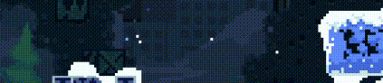

My favorite explorative step: *Giving up*

This write-up is *lengthy*. It goes in depth into nearly all design decisions, issues, and relevant technology. If I had to categorize it, this is an informal, detailed record of the challenges faced while exploring technology I previously had minimal experience implementing. 

As such, the ultimate goal of this project was to gain experience implementing reinforcement learning.

# Table of Contents
- [Summary](#summary)

- [Introduction](#introduction)

- [Learning Computer Vision](#learning-computer-vision)

- [Reinforcement Learning in Celeste](#reinforcement-learning-in-celeste)

- [Training](#training)

- [Changing the RL System](#changing-the-rl-system)

- [Evaluation](#evaluation)

- [Conclusion](#conclusion)

- [Extras](#extras)

# Summary
I designed and developed an introductory reinforcement learning project that uses computer vision to clear a room in Celeste. Using 60 screenshots per second, I created a vision system that isolates the character model from the background and tracks her movement using meanshift. The system feeds the character's position into a SARSA TD(0) learning loop. After considering hardware and time limitations, I reduced the action space and used reward shaping to improve performance. These changes improved performance from a 1% clearance rate to a 21% clearance rate when evaluating the produced policies over 100 attempts.

### Repository
Here's a link to the repository on github: https://github.com/q231508/Mind-The-Gap/tree/main

# Introduction
Before we start digging into the project, I've provided a brief overview of it.

### What is this?
This is a reinforcement learning project that focuses on the game Celeste. The goal is to train an agent to navigate through the first room of the first chapter, overcome 3 jumps, and reach the end successfully.

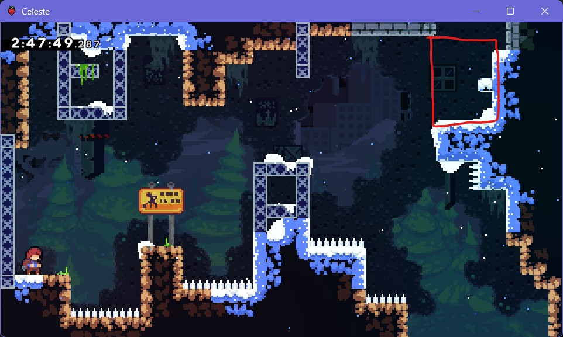

1A Room 1 - The goal is the upper right platform

The project utilizes computer vision and SARSA TD(0) to facilitate learning a successful policy.

### What is Celeste?
Celeste is a 2D platformer released to critical acclaim in 2018. Renowned for its grueling challenges and massive speedrunning presence, the game is frequently mentioned as one of the best modern 2D platformers.

### Why Celeste?
When considering what environment I wanted to use for this project, deterministic behaviour was a top priority. This would be my first full implementation of an RL system from conception to evaluation, so I thought an environment where I could easily observe repeated behaviour from identical inputs would be easier to work in. 

Videogames fit this desire nicely, and Celeste just happened to be one I was actively playing at the time. While thinking about what this project could look like, I realized that Celeste fit all the requirements I was looking for in an environment. 

### What is the goal?
As stated above, this is my first time designing and implementing an RL system from scratch. So, while producing the optimal policy would be compelling, that is not my goal. Rather, I started this project to get experience actually building something with RL, so I have 2 goals for the agent.
    
    1. Learn a policy that produces 2 consecutive clears

    2. Learn a policy that produces a >10% clearance rate

Anything beyond these two benchmarks will be considered a bonus for the project. 

### Why is this write-up so long?
I chose to go into so much detail because I wanted to make sure I don't forget what I've learnt on this project. Seeing as I don't have much experience with implementing RL or computer vision, the intention is to have a detailed log of what worked and failed. Explaining my design choices here is invaluable information I'll need for future projects.

### Extra information
This project is purposefully scoped to just the first room of chapter 1's A side. As such, I will be using the term "1A" whenever I refer to this level (chapter 1 A side). I will also use the term "room" to refer to the area seen in the screenshot above.

Additionally, the main character of the game (who you play as) is Madeline. So whenever I use Madeline in a sentence, I am referring to the character model.

With that out of the way, let's talk about vision.

# Learning Computer Vision
Before any kind of learning can take place, the program needs some way to get the character model's position. So long as it can determine the X and Y positions, the RL system should be able to work. A very basic approach.

This was the first issue that needed to be addressed when I chose to go with Celeste. I could not find an easy way to extract game data. I spent a few minutes looking for some kind of debug mode, but didn't find anything. There probably was some mod I could load in that would give me access to the data, but I wasn't too interested in that approach. So I settled on using computer vision. If I can't get character position directly from the game, then why not just look at the game itself?

## OpenCV
The initial sketch of the project was to:

    1. Determine Madeline's XY position <-- We'll use computer vision

    2. Feed this information into an RL system

    3. Train ??? thousand times

    4. Produce a working policy!!

Having no experience with computer vision, I chose to use OpenCV because it was the first library I checked out. 

They had an extensive catalogue of tutorials, so finding those that were applicable was quite easy. 

Ultimately, the most important one was about [tracking objects in videos](https://docs.opencv.org/5.0/tutorials/others/meanshift.html).

### Meanshift vs CAMshift
The link above sends you to OpenCV's tutorial on object tracking with two methods: meanshift and CAMshift. Both methods are essentially the same, with CAMshift meaning "Continuously Adaptive Meanshift". The core difference is that CAMshift will adjust the size and rotation of the tracking window while meanshift will not.

Meanshift is a tracking method that continually moves the center of the tracking window to the densest cluster of pixels within the window. If the current center is not the maximum density position within the tracking window, then meanshift will move the window to the max density area. This will repeat until it converges onto the max density position.

CAMshift is an extension of meanshift that changes the size and rotation of the tracking window. This differs from meanshift, as meanshift will not adjust the tracking window's size/rotation. So the question is: Does Madeline's model change shape in a way that justifies using CAMshift over meanshift?

The answer is no. In Celeste, Madeline's model only significantly changes shape when you crouch. However, crouching is not necessary to clear the first room of 1A. So meanshift alone is sufficient. 

I used the pygetwindow module and Multiple ScreenShots (MSS) to locate the game window and get a screenshot of the game every 1/60th of a second. Meanshift runs on every frame, shifting the tracking window as Madeline moves across the screen. We just need a way to make sure we've isolated Madeline in each frame. 

### Isolating Madeline
This proved to be the hardest part of setting up the tracking system. In the previously mentioned object tracking tutorial, OpenCV suggests using histogram backprojection. My understanding of it is as follows.

1. We produce a color mask. This mask will filter for colors that fit into a chosen range. Typically, these will be the colors of whatever object we want to track. In our case, we want to mask for the colors on Madeline's model.

2. The mask is then applied to an initial window. This window should contain/be the object of interest. In this case, the initial window will just be Madeline's character model.

3. The application of the mask produces a black and white projection. In this projection, visible pixels are those that are considered "likely to be Madeline". The brighter a pixel in this projection, the higher the system's confidence that it is Madeline. So we would expect to see Madeline's model as white.

4. Histogram backprojection then looks at the whole frame, compares it to the projection from step 3, and returns the pixels that are most likely to be our object. 

5. Each new frame is then compared to the initial projection from step 3. That initial projection is the baseline.

On paper that sounds fine, but my initial implementation looked like this. 

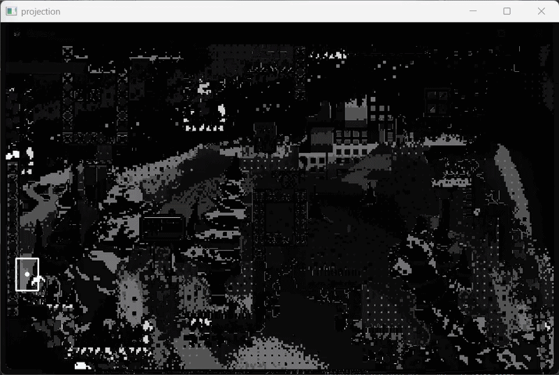

Histogram backprojection lol

Clearly this is not good. Every pixel in the projection above can be interpreted as the program saying "This might be Madeline". Darker pixels indicate low confidence, while brighter ones indicate higher confidence. So looking at the projection above, the program seems to think large parts of the environment are Madeline.

What we want is for Madeline to be the only lit-up pixels. This is because, in addition to wanting to only track Madeline, meanshift will wrongly lock onto the environment since it moves based on density. This behaviour can be seen in the gif above.

When I saw this for the first time, I thought the issue was due to the mask. Maybe the mask ranges were too big, or I was masking for a color that matches the background. I also started to think that maybe using just one reference wasn't enough. So I tweaked the logic and got the following.

 

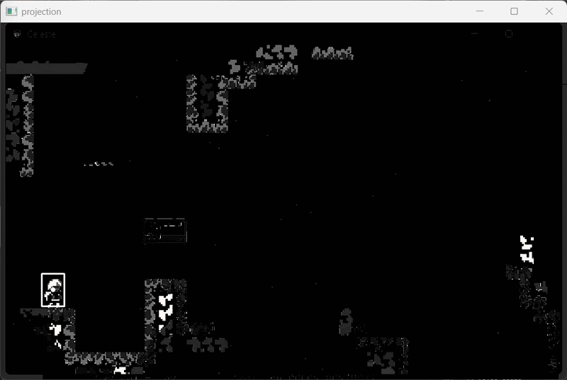

Histogram backprojection + repeated sampling

This is much better, but there's still too much of the background present. The program still thinks part of the environment might be Madeline. 

If you noticed, the environment in this second projection also seems to react to Madeline's movements. It gets brighter/darker as she moves, whereas the first projection did not have this behaviour. 

My assumption is that this has to do with repeatedly sampling the object in the tracking window, while backprojecting on every frame. If every backprojection is using a new Madeline reference, then the program's confidence in each pixel being Madeline can change much quicker.

### Color Thresholding
Between the second and third iterations of the projection, I decided to learn a bit more about histogram backprojection. While doing so, I started to wonder why histogram backprojection is needed at all. The lighting of the level doesn't change, and the color of Madeline's model doesn't change either (unless she dashes). If we know exactly what colors Madeline will be at all times, then we should know which colors she won't be.

With this thinking in mind, I decided to abandon histogram backprojection. The new approach was to just threshold for the exact pixel colors I wanted within a small error range. Since Madeline's model contrasts nicely with this room's environment, color thresholding ended up providing the most improvement to the isolation.

 

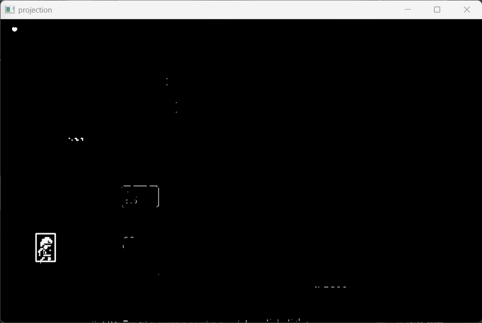

Color thresholding + repeated sampling

As you can see, the projection above is clearly only focused on Madeline. There are a couple of areas of the environment that still show up, but nothing large enough to derail meanshift. As such, we can now accurately track her movements in each frame. 

For completeness, we can compare the three iterations: 

    1. Histogram backprojection alone

    2. Histogram backprojection + repeated sampling

    3. Color thresholding + repeated sampling

 

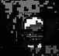 
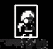
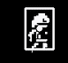

1 vs 2 vs 3

We see a gradual improvement in the isolation and detection of Madeline's model. 

Histogram backprojection alone has the weakest isolation, and the worst model detection. Madeline's model occasionally fades in and out while tracking. The fading indicates that the program doesn't always have confidence that the current frame's character model matches with the initial sample. This method also fails to remove the environment, which results in meanshift easily losing Madeline. My assumption was that we see this poor performance due to only using one reference for the whole program.

HBP with repeated sampling appears to be better than HBP alone. We are no longer comparing future frames to the singular, outdated sample of Madeline from the start of the program. Rather, we get a new sample to compare against every frame. There is still some fading, but this method's isolation and detection of Madeline's model is stronger and more consistent. The environment is still an issue, but we begin to see clear improvements.

Color thresholding with repeated sampling ends up with the best isolation and character detection. The background is no longer disrupting meanshift, and Madeline's model appears to have no fading at all. We take advantage of the knowledge that Madeline's pixels remain the same color throughout this level. As such, rather than relying on HBP to tell us which pixel is most likely Madeline, we just mask for Madeline's exact colors.

### Getting X and Y
Now that we can isolate Madeline from the environment, getting her X and Y values in each frame is trivial. I just took the X and Y values of the center of the tracking window.

Since the tracking window is set to focus only on Madeline, it has nearly the same dimensions as her model. Therefore, the center of the tracking window is around the same as the center of Madeline's model. 

The next piece is to develop a way to track and differentiate deaths from clears.

### Death Detection: Checking for a black screen
For this project, I opted to use SARSA for the learning loop. SARSA requires every episode to track when it reaches the terminating state. In this case, that would be death or reaching the goal. The issue is, how can we detect death using computer vision? What about clears? My initial idea was to simply check for a black screen. 

When Madeline dies, the screen turns black. So, an easy death detection is to check if the screen is black. The terminating state would be whatever state we were in right when the screen turns black. However, the death animation makes her move a bit before the screen turns black. 

 

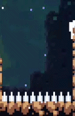 

She explodes

As you can see above, Madeline doesn't stay in one spot when she dies. This is a massive issue, since the terminating state would end up being logged in the wrong location. Over thousands of attempts, there's a real possibility that the agent misattributes death penalties to areas on the correct path due to this movement. So, we need to detect deaths faster. Preferably right when she dies. The solution I came up with was to sample the RGB values within the tracking window.

### Death Detection: Averaging RGB values
You may have noticed that, upon death, Madeline's entire model turns white. Not just her model, but even the resulting explosion has a large amount of white. This small detail is what fuels the next layer of the death detection.

The logic was as follows:

1. Observe the average RGB value of everything in the tracking window when we move around, jump, climb, die, and so on. 

2. Since white has RGB = (255, 255, 255), we especially want to note the average RGB value whenever Madeline dies. The sudden influx of white pixels should drastically increase the RGB average. This will be the death threshold.

3. Implement a check that sees if the average RGB value in the window is above the death threshold. If yes, then Madeline has died and we instantly know where the terminating state is.

This method generally manages to detect deaths quicker, and obtain the exact terminating state. For the tracking window used in this project, the typical average RGB rises to >125 when she dies. This is far above the 70-80 average observed otherwise. So it is a fairly reliable way to check for deaths quicker.

Death detection now has two layers. It either notices a death immediately, or falls back to the black screen detection if it misses the first check. 

### Reaching the goal
To detect clears, I hardcoded a goal zone.

 

The red box is the goal

 

If Madeline's X and Y positions are both within the zone, all actions from the agent will be lifted, a completion variable will be set to true, and the agent will automatically restart the level. This triggers a black screen. 

Since the agent reached the goal, the system records a clear rather than a death. By lifting all actions once the agent reaches the goal, the terminating state can be easily recorded. Importantly, only the first X and Y position that lies in the goal will be recorded. This avoids falsely recording many visits to the goal in one episode.

And we're done! That's the computer vision side, so we can now move on to the RL side.

# Reinforcement Learning in Celeste

Unlike computer vision, I actually came into this project with some knowledge of machine learning and reinforcement learning. I took a handful of ML and RL courses in my undergrad, but we never got the chance to build anything from scratch. Pretty much all of the coursework was theory, which makes sense. As a result, finally getting to build an RL system was a big motivation for starting this project.

The core resource I used to review my RL implementation was the textbook I received in one of my RL courses.

    Reinforcement Learning: An Introduction 
    2nd edition 

    by Richard S. Sutton and Andrew G. Barto

So far, I think it's quite good. I would definitely recommend it if you are just starting to learn RL. 

Now, back to the project.

## SARSA TD(0)
When I first settled on Celeste, I had a strong inclination to use SARSA for the learning loop. 

### What is SARSA?
Put simply, SARSA is an acronym. It can be written as:

    S A R' S' A'

This is because the term actually refers to five events:

    (State, Action, [State transition] Reward, [Next] State, [Next] Action)

    or 

    ( S[t], A[t], R[t+1], S[t+1], A[t+1] )

Each element above is an event needed to create the update formula:

    Q(S, A) = Q(S, A) + alpha * [R + gamma * Q(S', A') - Q(S, A)]

Gamma is a variable, always between 0 and 1 (inclusive), that discounts/lessens future rewards. Smaller gamma means more discounting, which results in future rewards having less of an effect on learning.

Alpha is a step size parameter, also between 0 and 1. It determines the learning rate of the system. Smaller step size results in slower learning, while larger step size results in faster learning. At 0, the system will learn nothing. At 1, the system will only consider the most recent information. 

Q(S, A) is the q value of a state-action pair. For any given state, there are multiple actions that can be taken. When the agent takes an action in a given state, we want to assign some estimated value to that pair. The update formula above either rewards or penalizes the system for taking action A in state S. 

### What about the TD(0)?
TD stands for *Temporal Difference*. It is a learning method that learns during episodes. My understanding is that it uses estimates to update other estimates, rather than waiting for the true value. This enables it to learn during episodes, unlike Monte Carlo, where learning occurs at the end of episodes. However, since it relies on estimates, the learning isn't always accurate. The 0 tells us that credit is only being assigned to the immediate, previous state-action pair. 

### Why SARSA TD(0)?
The reason I chose to use this is because of how it learns. SARSA TD(0) improves the policy after every state transition, so the policy is updated every time Madeline moves or takes some action. I felt it would be beneficial to learn during episodes, rather than at the end of them. So SARSA TD(0) was my choice. 

With that in mind, we'll now go over how states, actions, and the epsilon-greedy policy are set up in this project.

### Defining the states
How we define states directly affects the agent's ability to learn a successful policy. 

In this project, one state is equal to one pixel of the game window. So:

    state = (x, y)

This is a very basic approach, where a singular pixel maps to a singular state. It's also a very naive approach because for a 764 x 482 pixel window, we end up with 368,248 states. The vast majority of which are never visited...

To store all of these states I used a dictionary, where each state is a key. The value is then an action distribution of each possible action. This dictionary is called a "Q table".

### Picking actions
Celeste is a game with 7 actions:

    Up, down, left, right, jump, grab, and dash

Each action can be held or released, so the max number of possible actions for the agent is 14. As outlined above, every state in this project is the key to the Q table. The value corresponding to a key is then the action distribution of that state.

    q_table[state] = [action distribution]

All states in this project start with a uniform action distribution, so all actions are equally likely to be chosen on first visit to a state. As the agent moves through the room, and revisits states, the distribution for a given state changes. For 14 actions, the distribution could eventually look like this:

    [-10, -7, -8, -2, -5, -6, -3, -1, -6, 2, -9, 3, -5, -1]

Where each action is mapped to one of the indexes in the distribution above. In this case, index 11 (3) is the best looking action due to having the highest value. 

For this project I used the random module to select actions, but I quickly learned random doesn't support distributions with negative values. So, softmax is used to transform the set of numbers into a usable probability distribution.

The agent then follows an epsilon-greedy policy to guide how it chooses from this distribution. 

### Epsilon-greedy
The policy used by the agent is e-greedy. This is a decision-making policy that features an *e*% exploration rate. That is, in a given state, the agent will take a random action *e*% of the time. The other 100 - e% of the time, the agent will take the best-looking action. The best-looking action is the one with the highest value in the action distribution. If multiple actions are tied as the best choice, then the agent will randomly choose from among those best. 

Before starting training, I chose not to include dashing in the final action set. This is because, as seen below, the tracking system struggles to follow Madeline when she dashes. 

### The dashing problem

 

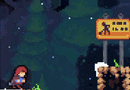

Tracking dashes

Despite masking for the color change, the tracking system fails to always remain locked on Madeline. The dash leaves afterimages and blue pixels that can derail the meanshift tracking. Luckily, 1A was designed such that it can be completed dashless. So removing dash as an action will not prevent the agent from clearing the room.

With the RL system in place, we'll now take a look at how automation was implemented before getting into the actual training.

## Automation
This project uses automation for 4 key tasks: 

    1. Calibrating the environment before any attempts

    2. Loading in previous training data

    3. Resetting the room after every death/timeout/clear

    4. Recording performance logs

Introducing automation to these areas reduced the number of manual interventions needed when running training sessions. Over thousands of attempts, manually resetting the environment simply wouldn't make sense. Loading in previous training data was especially valuable as it allows the agent to continue from a baseline policy rather than always starting from scratch.

### Calibrating the environment
As outlined above, I needed a way to ensure the environment remains the same whether on attempt 1 or attempt 10000. That means making sure the game window is the same size for all attempts, ensuring all attempts use the same-sized tracking window, ensuring all attempts start from the same initial location, and so on. This is important because if I train multiple agents, comparing their performance only makes sense if they were trained in the same/similar environments. Drastically different environments will produce drastically different policies, so having a calibration system in place was a necessary addition.

The solution I came up with did the following:

1. At the beginning of the very first training session, after locating and focusing on the Celeste game window, the system would record the size of the game window into a file. Every training session checks if this file exists. If the file exists, then the system resizes the Celeste game window to the provided size. Otherwise, the system creates a new file with the current size of the game window.

2. The second step is an action sequence that automatically opens the menu to restart the level. For this room, Madeline will always respawn in the same spot when restarting the level. This sequence then makes sure all sessions start in the same location.

3. With Madeline in the starting position, a screenshot is sent to the computer vision system. Once received, a clickable version of the screenshot will show up. The user can then drag the desired tracking window to track Madeline. Once finished, the size, dimensions, and XY position of the window are recorded to a file. Just like the game window, every training session will look for this file. If it exists then the tracking window is set to the provided specifications. Otherwise, the user can define a new tracking window. 
    
These checks and actions are run at the beginning of any training session to ensure the environment is easily replicated. 

### Resetting the room
Resetting the room follows two potential sequences. The first occurs whenever the agent clears the room or stays in the same XY position for >3 seconds:

    1. The agent lifts all actions using pydirectinput.keyup("some action") for each action
    
    2. It then runs an input sequence that opens the menu to reset the level
    
    3. It sleeps for a few seconds
    
    4. Then finally moves the tracking window to its initial position, i.e., where Madeline has respawned

    5. The next episode runs

The second version is almost identical, and only occurs for detected deaths:

    1. The agent lifts all actions using pydirectinput.keyup("some action") for each action
        
    2. It sleeps for a few seconds
    
    3. It moves the tracking window to its initial position, i.e., where Madeline has respawned

    4. The next episode runs

Both of these sequences exist to make sure the tracking system is locked onto Madeline's position before any episode runs. Using sleep after clearing all actions ensures that Madeline can finish her respawn animation before the agent starts sending inputs again.

### Exporting and loading training data
After every death, clear, or timeout, the system continually writes lines formatted as below to a ".txt" file:

    Deaths: X, Clears: X, Attempts: X, Distance: (X, Y)

The system also records the visitation frequency of each state. When the training session ends, the system exports two files:

    1. An ".npy" file that contains the visitation frequency of each state

    2. A ".pkl" file that contains the learnt decision-making policy of the agent

The user can then provide the ".pkl" file, and the system will load it in before starting a training session. This allows the agent to pick up from some established baseline.

With that, we're done explaining the RL side! Now we can begin training the agent.

# Training
Alrighty, we've finally reached the training stage. This was easily the most exciting part of the project, but it was also the most time-consuming portion *by far*. 

A lot of the improvements made during training were based on heatmaps. Each heatmap was generated from the state frequency of each training session, so we can estimate how successful the agent was in the beginning based on the images. If you want to look at each one on its own, I've included them all in the /heatmaps folder. They are numbered 1 through 29, corresponding to training sessions 1 through 29.

One limitation is that quite a bit of training data is no longer available, particularly the data for early training sessions. However, I still have heatmaps from each session. So we can still get a sense of how performance progressed throughout the project.

## Early training sessions
Like I said, the only surviving data from early training sessions are the heatmaps. There isn't too much we can analyze from heatmaps alone, so we won't spend too much time looking at these. 

Early training sessions had 12 actions to choose from:

     hold up, hold down, hold left, hold right, hold jump, hold grab

     release up, release down, release left, release right, release jump, release grab

As mentioned earlier, dash was excluded from the list of possible actions due to tracking issues.

These sessions also had:

    A -0.1 penalty applied every frame the agent wasn't at the goal. This was to encourage the agent to move. 
    
    A -10 death penalty 
    
    A +100 reward for reaching the goal.
    
    Step size 0.5 
    
    5% exploration

    No discounting

With that, I started training the agent and obtained the following 14 heatmaps.

 

blueish background == session #1

Pretty interesting. Here are a couple of observations:

    1. Sessions 1, 2, and 4 all saw zero clears.
    
    2. The first recorded clear comes in session 3.

    3. Session 5 appears to only have 1 clear.

    4. Sessions 5 through 14 all saw at least 1 clear.

Looking at the heatmaps, we can see that these early sessions all seem to have very low clearance rates. Many of them appear to have rates <1%. I remember session 2 was ~1000 attempts, so 0 clears was pretty disappointing. Even without the exact data, we can estimate that the clearance rates of these early training sessions were also quite low. 

All of these attempts were trained from scratch, so they weren't building off of previous sessions. This could have been why they seemed to perform so poorly: they just didn't have enough time and attempts to learn a working policy. As such, after session 14, I decided to see how the agent performed with 10k attempts.

## Ten Thousand Attempts: Training Session #15

Luckily, I do have all the files for this training session. So we can do a bit more of an analysis here. 

 

The 10k heatmap

 

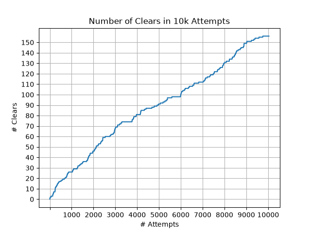

Clears vs Attempts

 

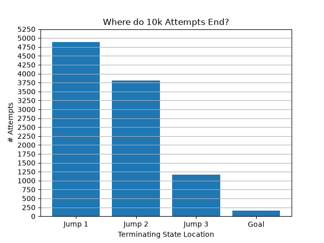

Attempts always end in one of these areas

The exact number of attempts in this training session was 10,036, with only 156 clears. This translates to a 1.55% clearance rate, well below my goal of 10%. Seeing a 1.55% clearance rate indicated that the learning system was not working as intended. The agent was not learning a successful policy. I was under the impression that a 10% rate would be fairly quick to achieve, so my immediate assumption was that something had gone wrong.

There's quite a bit that we can infer from the figures above. The first one we'll look at is the bar chart.

### Analysis: Where is the agent dying?
The bar chart tells us a few things. To make things easier, I've written the zones of the room onto the image below. 

 

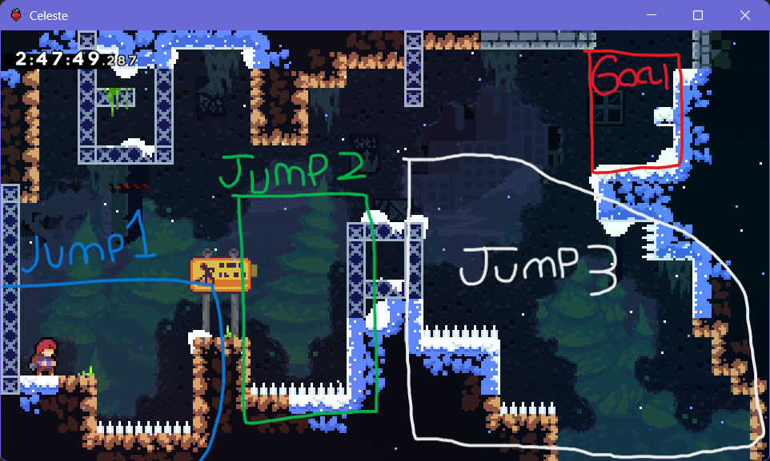

State termination zones

As you can see, there are 4 zones in this level: Jump 1, Jump 2, Jump 3, and the goal.

 

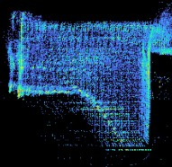

Zone 1

Of the 10k attempts, nearly half are terminating in the first zone, "Jump 1". This clearly means that they are dying to the spikes on this jump. The agent is failing to jump over the spikes and climb the wall almost half of the time. 

Looking at the section corresponding to this zone on the heatmap, we see tons of visits to nearly all states in the zone. There doesn't appear to be any distinguishable "jump arc", rather just a blue smear across the zone. The top portion of the heatmap here is flat for the whole zone, indicating that the agent is jumping at random points over 10k attempts.

It doesn't appear to have learnt which spots are better to jump from. However, at the bottom of the zone, we can see an arc that is a bit more vibrant than most states in this zone. The states in this area are visited when the agent just walks off the ledge, so we can infer that a decent chunk of deaths were just walk-offs.

 

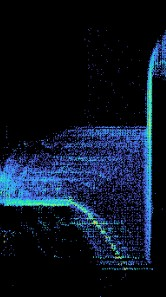

Zone 2

Just over 37% of all attempts are terminated in zone 2, "Jump 2". Once again, this means that the agent is failing the jump. Either it just falls into the spikes, or it gets to the wall but fails to climb up. 

Looking at the heatmap, we see the same arc at the bottom of this zone. This time it is even clearer that these are the most visited states in the zone. The states that would be visited upon jumping in this zone aren't as vibrant as in zone 1. 

However, we can still see a smear of blue when looking at this zone's heatmap. This tells us that, once again, the agent did not learn which part of the platform is better to jump from. 

 

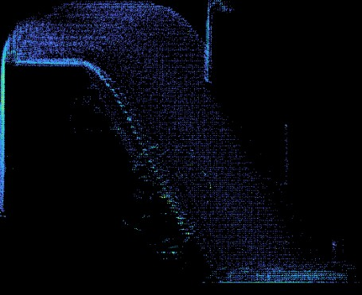

Zone 3

Looking at zone 3, "Jump 3", we see that ~12% of attempts are dying here. The heatmap clearly illustrates the issue. Many attempts are dying on the spikes or, as seen by the pool of states at the bottom, are failing the jump. We can infer that the agent once again does not know when or where to jump due to the smear on top of the zone 3 heatmap. Had it learnt to jump in a specific spot, we would expect to see a clear, narrow groove in the heatmap displaying the jump arc. Yet, we see a fairly spread-out groove across the top of the zone, indicating that the agent is jumping at random locations.

The session ends with 156 clears, and no consecutive clears were observed. Looking at the line chart, we see that the agent is consistently clearing just over 1% of runs every 1000 attempts. However, there are some plateaus where it fails to clear for hundreds of attempts.

My read was that 156 clears most likely wasn't a massive outlier. There's nothing to suggest that this session was uniquely unsuccessful in comparison to the previous 14. Based on the line chart, it would be reasonable to infer that the agent was routinely struggling to perform better than 2%. As such, I had to change the RL system to get faster learning.

# Changing the RL System
## The First Change: Adjusting Actions
I'm confident the agent would eventually find a successful policy given enough attempts. The reward propagation would have reached far enough for it to have helped the agent determine which actions are best. However, waiting for such a result was out of the question. With the current setup, training on 10k attempts alone took an entire day. 

What happens if it needs 50k attempts before it starts to clear >2%? What about 100k? 1 million? Considering how long 10k attempts took, I couldn't realistically set aside days just to train this agent. My laptop wouldn't be able to handle such prolonged training in the first place. So I needed to find some other solution.

### Cutting actions
At the start of this project, the agent had access to 14 actions. We reduced this number to 12 since we removed dashing due to the [dashing problem](#the-dashing-problem). So after observing the last 10k attempts, I decided to cut unnecessary actions. The available actions were reduced from:

     hold up, hold down, hold left, hold right, hold jump, hold grab

     release up, release down, release left, release right, release jump, release grab

to:

     hold up, hold right, hold jump, hold grab

     release up, release jump

Fairly drastic. You've probably noticed that there is no action to release right or grab. This was done to:

1. Reduce the chances of the agent standing in place. The moment it decides to hold right, the agent will continue moving forward for the duration of the episode.

2. Eliminate the situation where the agent reaches the wall but never grabs. Once it chooses to hold grab in any state, grab remains held for the entire episode.

Given my hardware limitations, I figured this would be the best choice to give the agent a chance, especially due to one major issue.

### The explorative issue
At the top of this write-up, I placed this gif of Madeline failing the last jump of this room. 

My favorite explorative step: *Giving up*

The caption of this gif is a real issue that has plagued thousands of attempts. Many attempts would be on track to clear the level, just to have the agent suddenly decide it should die instead. Since I was using an e-greedy policy, the agent could always choose some action that kills the run during the explorative step. In the gif above, all the agent has to do is hold jump. Yet, due to the explorative step, it chose to release jump at some point. 

The worst time this can happen is when it actually clears the gap. Once it reaches the wall in the gif above, all it has to do is keep grabbing and climb to the goal. But the explorative step could make the agent release grab, killing the run.

In my eyes, this is pretty bad. Exploration is great for getting the agent unstuck and letting it unlearn a poor policy, but it's an issue when exploration directly prevents the agent from clearing the level.

This project was especially susceptible to explorative deaths due to how states were defined. On the final jump alone, there are thousands of pixels between the lip of the jump and the goal. Since states were defined as:

    1 state = 1 pixel

even if I set exploration to 1%, the agent still has a real shot of randomly picking a poor action since there are so many states before the goal. As seen with the 10k session, the agent needs to die thousands of times just to start reducing the probability of the policy randomly picking a poor action. As such, to try to resolve this issue, I chose to cut the unnecessary actions. 

 

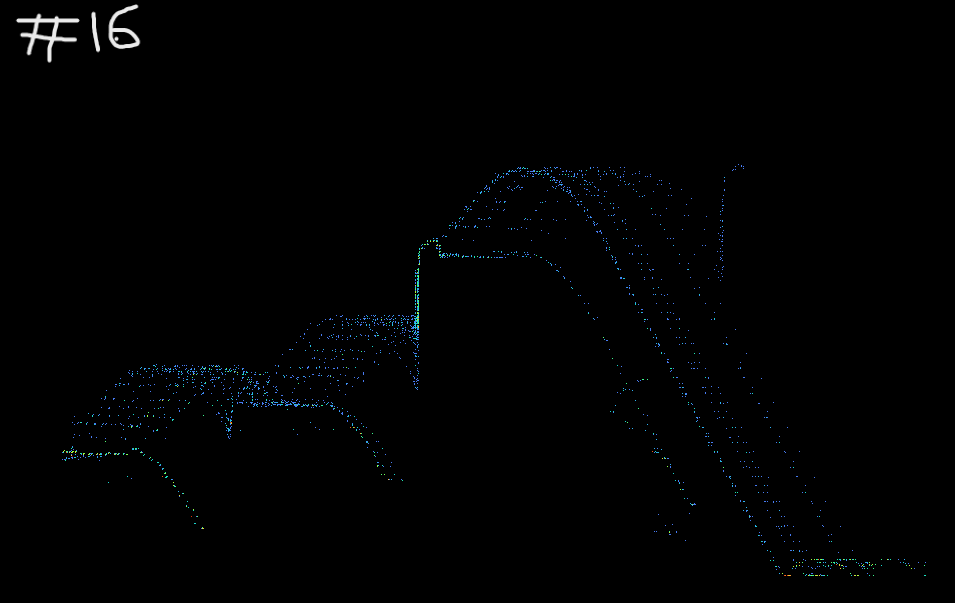

After the first change: Sessions 16 - 21

There isn't much of a difference visually between these heatmaps and the previous batch. However, changing the available actions was just step one. We still need to help the agent learn.

## The Second Change: Reward shaping
Up until this point, the agent only received feedback when it:

    1. Moves:  r = -0.1

    2. Dies: r = -10

    3. Clears: r = +100

The point of the reward is to help the agent make decisions as it moves across states. Had the states in this project been set up better, this reward system could have been more effective. But they weren't. So this simply takes way too long to work as is. If the agent chooses an action that will result in it dying, the terminating state is often thousands of states away. The reward propagation you'd expect to occur suddenly requires thousands of attempts to even reach. There are many more issues due to this state definition, so we need a workaround.

The solution I settled on was reward zones. These zones would provide feedback more frequently and closer to the actual states that led to the rewards. This way, the agent can learn which actions to take at a quicker pace. 

Based on the analysis of the 10k session, the main issue was that the agent was failing to jump in good locations. It was either jumping randomly to its death or not jumping at all. So I introduced two types of rewards. 

1. For getting past a jump. So if the agent managed to go from zone 1 to zone 2, there would be a reward. Same with zone 2 to zone 3. The point of this was to get the rewards to propagate quicker and guide the agent to the zones. 

2. The agent got a reward if it jumped in specific locations. The biggest issue with the agent is that it doesn't know where or when to jump. So I manually tested each jump to determine where the agent could jump from to still reach the wall. In doing so, I set these reward zones at spots where the agent is likely to clear the jump. The intention is to reward the agent for jumping, and get it to learn where to jump from.

 

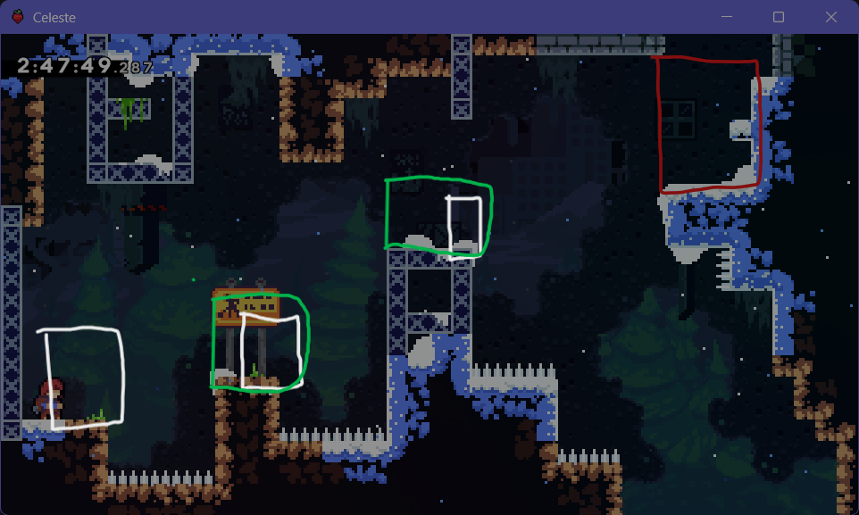

Green = reward for reaching platform, White = reward for jumping

The addition of these rewards was intended to encourage better actions. They served as mini goals for the agent to hit as it worked its way through the room. 

 

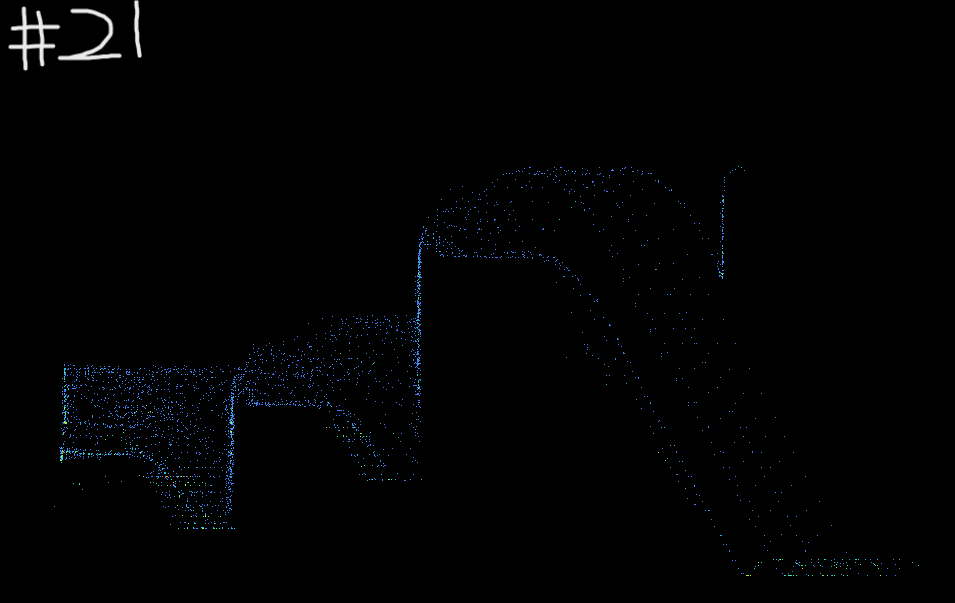

Sessions 21 - 24

These two additions saw immediate improvements. Between sessions 21 and 24, the difference is clear. 

 

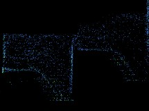
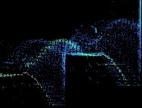

10k session vs session 21 vs session 24

We see the development of prominent jump arcs in zone 1 and zone 2. This is behavior that was not seen during the 10k attempt training session, as the agent had not yet determined where it should be jumping from. When it starts to receive more rewards for certain actions, the policy begins to take those actions more frequently.

So, the agent is starting to learn the correct jump locations in zone 1 and zone 2. But there doesn't appear to be anything similar going on with the last jump. The agent still jumps in random spots, even though there is a reward for jumping in the correct location. So I decided to add penalty zones.

### Penalizing poor jumps
The final jump of this room requires the agent to initiate, and hold, a jump at the edge of the third platform. If done correctly, Madeline will reach the ice wall on the left, and all that remains is to grab and climb up the wall. Due to the explorative step, and the need for jumps to occur in a precise spot, the agent was struggling to learn where to jump from. 

To try to address this, I added two penalty zones to the project and 1 extra behavior:

1. On the third platform, the agent received a substantial negative penalty if it jumped before the ledge. I made this penalty fairly large in hopes of immediately discouraging jumping at that point. Paired with the reward for jumping in the correct location, the agent should eventually learn a policy that jumps at the right spot.

2. After jumping, the only action that can ruin the run is "release jump". So I added a penalty zone to the gap between the platform edge and the final wall. If the agent releases jump within this gap, it receives a substantial negative penalty. The intention is to discourage releasing jumps.

3. To give the agent a chance to actually attempt jumping, I added a forced action upon reaching any of the platforms. The moment the agent reaches one, the first action will always be "release jump". I added this because there were many runs where the agent gets to the platform, but because it hadn't released jump yet it can't jump.

 

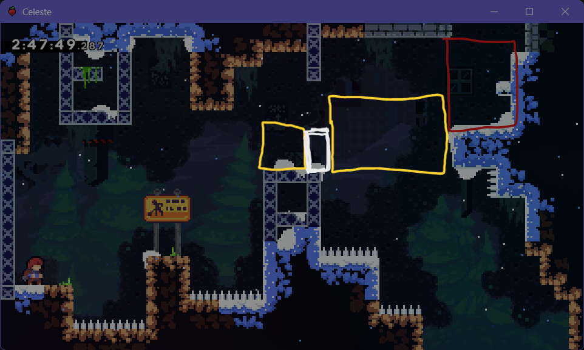

Yellow = penalty zones, White = reward for jumping

In the image above, jumping triggers the left penalty zone, while releasing a jump triggers the right one.

After adding these changes, I trained the agent again, hoping to see better jump trajectories in the 3rd zone.

 

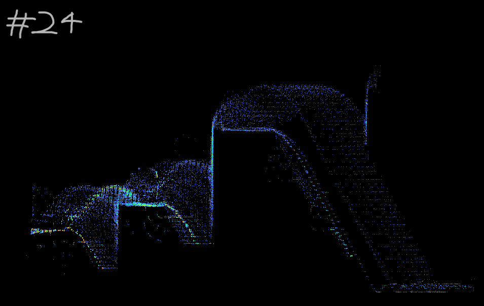

Sessions 24 - 29

As you can see, these additions had the intended effect. Sessions 25-29 all show a clear jump trajectory for the final jump. As I refined the reward/penalty locations to make sure the agent would actually reach the wall, you can see the arc on the last jump gradually move further to the right. We see similar arcs in zones 1 and 2, indicating that the agent was now learning when and where to jump.

### How much did this help? 
The final substantial training sessions of this project were #27 and #29. 

Session 27 built off of the data from sessions 22 through 26. After I adjusted the possible actions, I began exporting the policy and loading it in for the next session. This meant I could adjust reward values and avoid having to train again from scratch. If we compare the first 10k session to session 27:

 

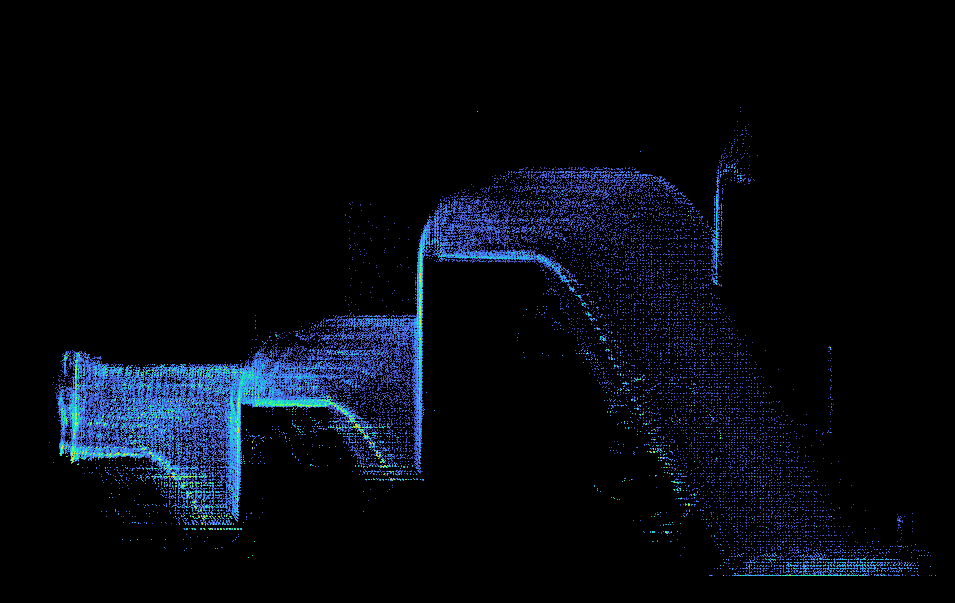

Session 15 vs 27

The difference is quite clear. Adjusting the possible actions and introducing reward shaping resulted in the agent learning a policy that knows when to jump. These changes made it easier for the agent to learn how to clear the room, since it was now receiving feedback more often. As a result, the heatmap shows clear arcs depicting where the agent learnt to jump from.

I was quite happy with the clearance rate of session 27. After a brief 28th training session, I exported the policy as a baseline and decided to do an extra 10k attempts for the final bit of training.

## Final Training
The log file for this final training session is no longer available, but I still had the state frequencies. Since the system only adds 1 to the goal state on every clear, counting the number of visits to states in the goal could tell us the number of clears. I tested this on the previous 10k training session, and against the evaluative sessions. The results were identical to the recorded clears, so we can estimate that this last session had ~1,388 clears. 

However, despite succeeding in learning where to jump, it produced a very poor policy. 

 

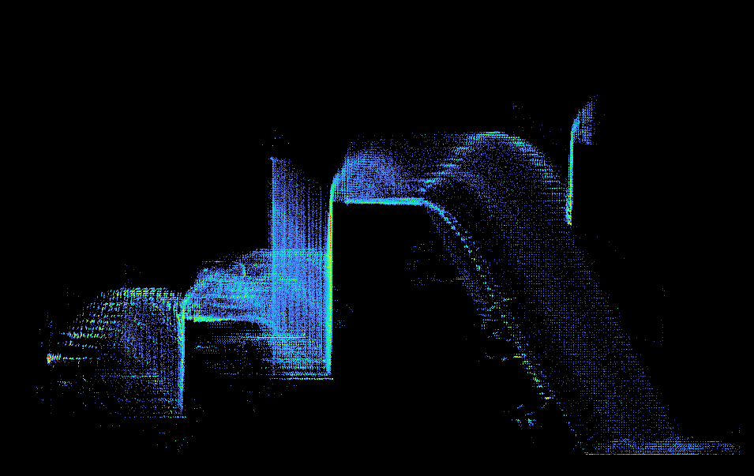

Final Training Heatmap

The reason was twofold:

1. I set exploration to 0. My intention was to refine the already established behavior over 10k attempts. This ended up being a mistake as the agent learnt a policy that stuck to the zone 2 wall. 

2. I massively increased the reward/penalty values. My thinking was that having larger values would encourage/discourage actions faster. What it really did was skew the trajectory. If a good action got a penalty or a bad action got a reward, there was often nothing that could be done. 
    
Since there was no exploration, once the agent converged onto this policy, there was no changing it. I had added a timeout feature that checked whether the agent was stuck in the same area for >3 seconds. But it assumed movement by checking if the tracking window had moved to a new state. Since every pixel was in a unique state, and the tracking window moves a bit even if Madeline is frozen on the wall, the timeout never occurred. The action was never penalized beyond the movement penalty. After 10k attempts like this, the agent learnt to stick to the wall instead of climbing it.

The heatmap depicts this issue quite clearly. This is the *only* session where such a vibrant smear of blue is seen in jump 2. No other heatmap visited those states as much. The reason we see something like this here is that the agent is refusing to climb up to the third platform. Once Madeline runs out of stamina, she begins to slide down the wall. This finally changes the states, leading to the agent jumping outwards.

 

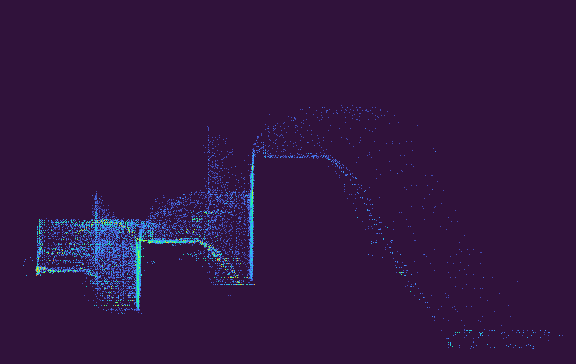

Every other training session's heatmap

Seeing this, I chose to export the policy and evaluate it against the version produced from training session 28. 

# Evaluation
For this section, I evaluated three policies.

    The previously analyzed 10k attempt policy
    
    The policy obtained from training session 28
    
    The final policy obtained from training session 29

Each policy had 100 attempts to clear the room in a fully greedy setup. So exploration was set to 0, and the policies chose the actions they deemed best.

## Results
We'll take a look at each policy individually. 

### Policy #1: The 10k policy
This policy was looked at [earlier in the write-up](#ten-thousand-attempts-training-session-15). It achieved 156 clears in 10,036 attempts. The training that produced this policy did not have reduced actions or any reward shaping, so it serves as a nice "before" to compare future policies against.

 

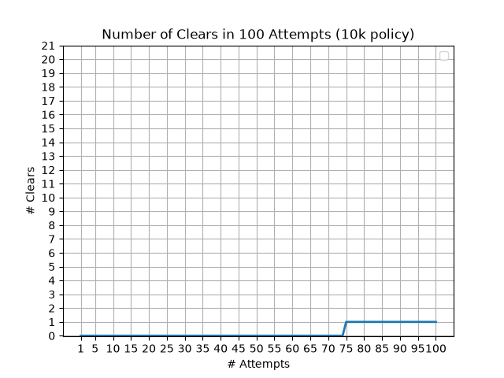
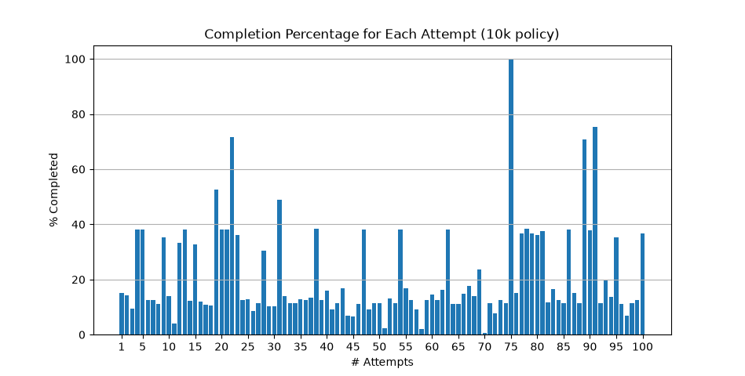
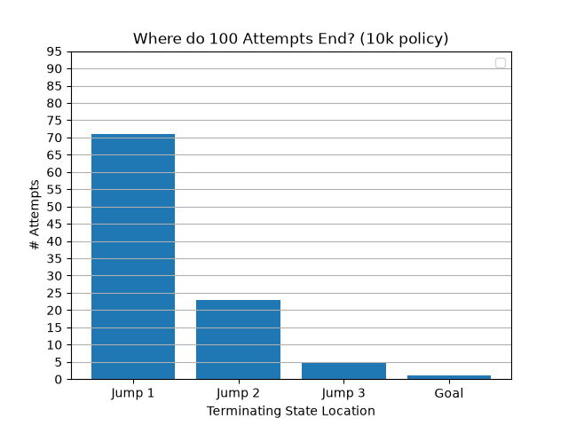
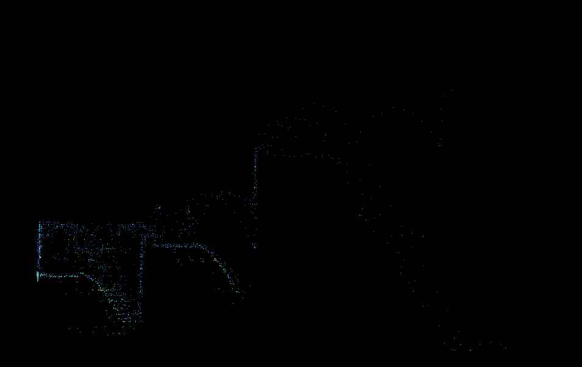

Policy 1 Results

Looking at the figures above, we see two main things:

1. The total number of clears was 1, therefore a 1% clearance rate. This is consistent with what we saw when analyzing this policy against ten thousand attempts. There we saw ~1.55% clearance, so 1% is within expectations for this policy.

2. 71 attempts failed the first jump. 71% of attempts failing on the first jump indicates that the agent doesn't have any notion of where or when to jump. As seen in the heatmap, we start to see a familiar smear in the first zone since the agent is essentially trying things at random.

There is not much else to say about this policy. It did not have the benefit of training with reduced actions, nor was there any reward shaping. Maybe with even more attempts it could eventually improve further. But, as it is now, the policy fails. It did not produce >10% clears, and there are no consecutive clears.

### Policy #2: Session 28's policy
This is the policy obtained at the end of the 28th training session. At that point, I had already reduced the number of actions and introduced reward shaping. The policy was built over multiple sessions.

 

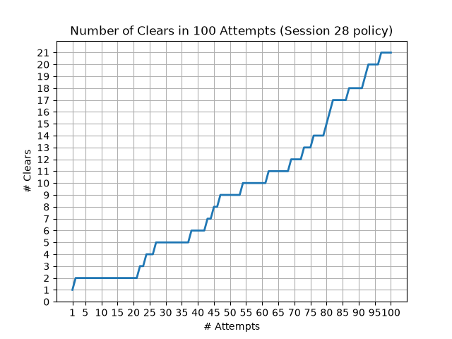
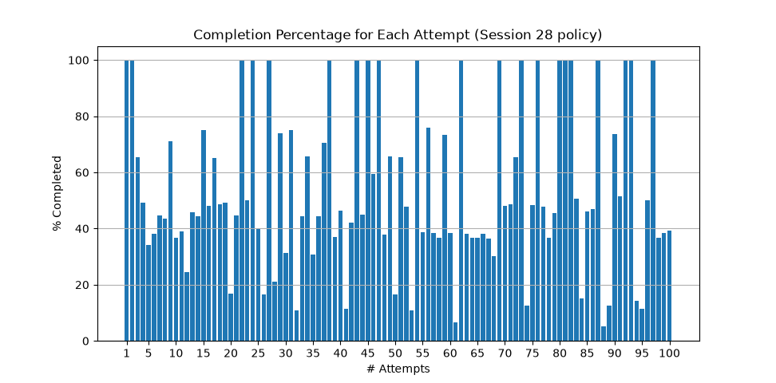
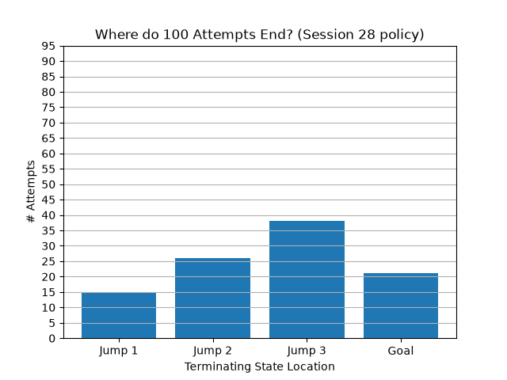
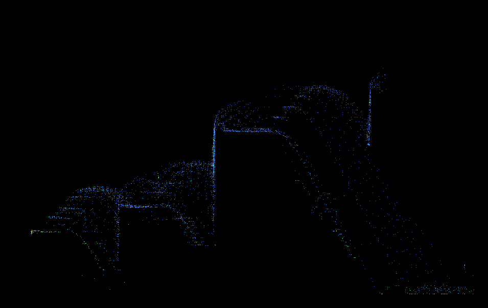

Policy 2 Results

Looking at the figures above, we see the following:

1. The total number of clears was 21, which means the policy had a 21% clearance rate. 

2. Out of 100 attempts, 38 of them failed the final jump. However, 59 attempts in total managed to reach the final jump. This indicates that the policy had learnt how to reach the 3rd zone fairly consistently. On this jump specifically, 21/59 attempts made it to the goal (~35.59%)

3. The policy started with two consecutive clears, then 19 failed attempts before clearing again. This was the largest gap between clears observed in the evaluation. There are similar, albeit smaller, gaps scattered through the runs, indicating the agent struggles to consistently follow the successful policy.

4. There were 2 double clears and 1 triple clear. In terms of consistency, this is a good sign that the policy is repeatable. 

5. The heatmap shows visible jump arcs, suggesting that this policy has an idea of where and when to jump.

This policy is clearly a success. The clearance rate of 21% is just over 2x my goal of 10%, and we see that the policy produces 2 double clears and a triple clear. This improvement is further evidence that reducing actions and reward shaping have had a clear effect on policy performance.

### Policy #3: The final training policy
This policy was obtained through ~10k extra training attempts after session 28. The policy builds off of policy 2, and uses the same reduced action set. However, it was trained in a fully greedy system. Additionally, rewards were massively increased with the intention to encourage more clears on the final jump. It is explained [here](#final-training).

 

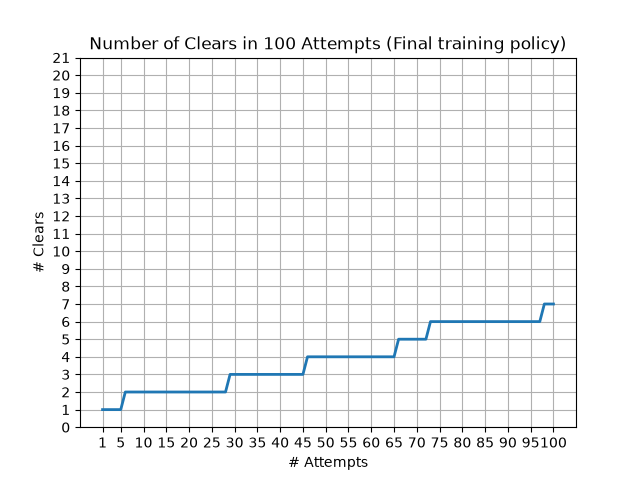
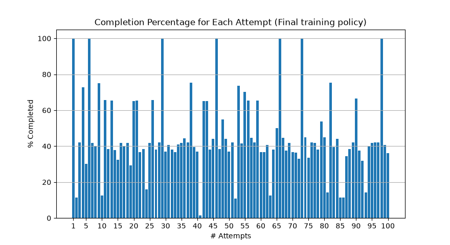
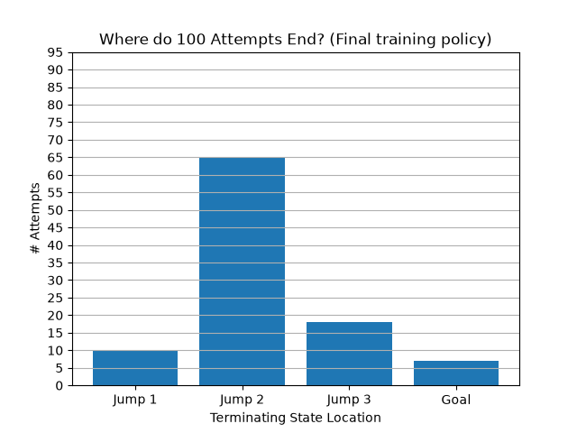
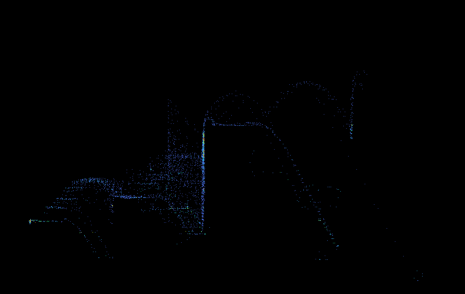

Policy 3 Results

Taking a look at these results, we see that:

1. This policy disproportionately fails on the second jump. More than half of all attempts ended in this zone. Such a result is a clear indicator that the policy learnt is poor.

2. Despite a ~1,388 clears over ~10k training attempts, the evaluation here only clears 7 times. That's a pretty big drop in clearance rates. The most likely reason is that a large number of those training clears came before the policy started to degrade.

3. Of the 25 attempts that tried the final jump, only 7 managed to reach the goal. 

4. There were no consecutive clears.

This policy is better than policy 1, but it is worse than policy 2 overall. The clearance rate is lower and below my stated goal of 10%. There are also no consecutive clears. The extra training resulted in producing a policy that clings to the wall in jump 2 rather than climbing up it. However, the most telling sign of failure is that the extra training did not produce more consistent clears on the final jump. This policy is less consistent on the final jump than policy 2. The one bright spot is jump 1, where it outperforms policy 2 (more on that below).

While extra training can, and often will, result in better performance, a fully greedy setup with massively increased rewards will just skew the policy towards poor performance.  

## Comparing all 3
If we then compare all 3 policies:

 

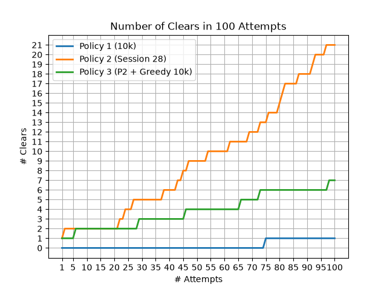
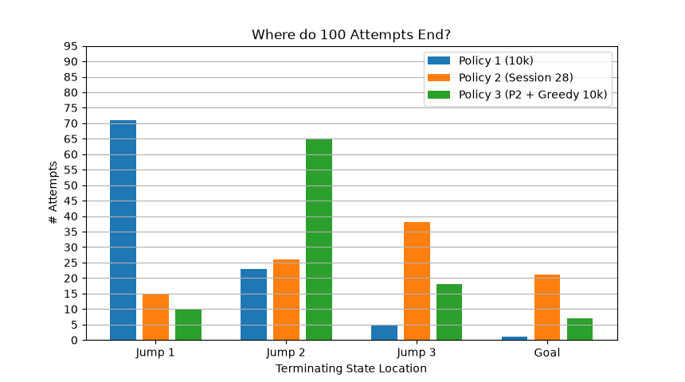
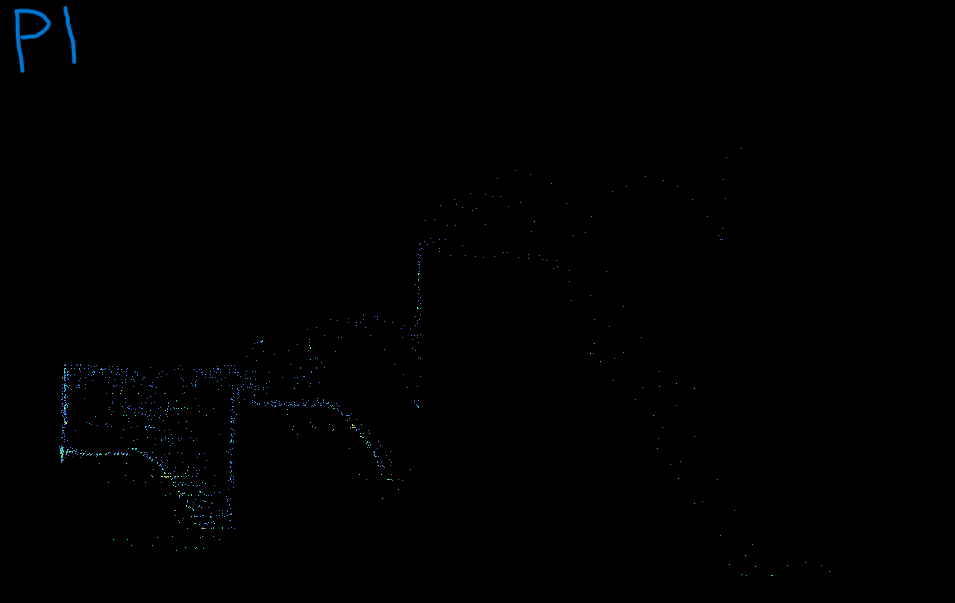

All 3 policies compared

We see a couple of things:

1. Policy 1 is dying more than any other on jump 1. Even when policy 3 has learnt to essentially kill itself on jump 2, policy 1 has more deaths on the first jump.

2. Policy 3 is actually outperforming policy 2 on the first jump. This indicates that the extra training further increased the policy's consistency on the first jump. 

3. Policy 2 has the most attempts at the final jump, and has the best clearance rate of such attempts. 

4. Policy 2 has 21 times as many clears as policy 1, and 3 times as many clears as policy 3.

5. Policy 2 had 59 attempts at the final jump. This is still less than the number of deaths policy 1 had at jump 1, and policy 3 had at jump 2.

Policy 1 is the worst, as expected. The number of actions and lack of reward shaping appear to have prevented it from learning at a faster rate. It undoubtedly would have performed better with more training, and it would have been interesting to compare the resulting policy. However, that was unrealistic with my current hardware limitations.

Policy 3 ended up being a warning against impatience and poor training. Had I kept exploration, and more intelligently tuned rewards, the convergence onto its poor behaviour could have been avoided. It's entirely speculation, but there's some evidence to suggest policy 3 could have actually finished better than policy 2. Policy 3 was building off of policy 2, and was outperforming policy 2 on the first jump. The extra training clearly had a positive effect on jump 1, so it would be worth looking at again in the future.

Policy 2 is the runaway winner among the 3. It has the highest clearance rate of the 3 policies. However, it's fair to say that there's tons of room to improve. After its early clears, the agent struggled for 19 attempts, then started to crank out clears more frequently. Additionally, the fact policy 3 was better on jump 1 suggests that consistency is still a pretty big issue here. If I ever revisit the project, a 21% clearance rate with multiple consecutive clears is a decent new baseline to start from.

# Conclusion

 

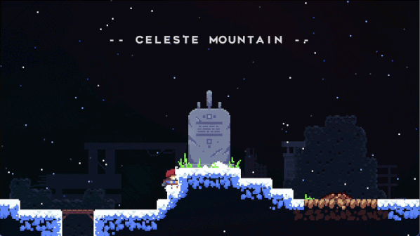

*210 hours, 84k deaths*

And we're done! It was really interesting to design something like this from start to finish. I'd intended to only do a reinforcement learning project, so getting a peek at some computer vision was definitely a highlight. The reinforcement learning side was pretty eye-opening. Looking back, I can tell that a ton of the issues that arose in this project stemmed from my inexperience. Even though I hit the stated goals, I understand that there is a long way to go. 

## Verdict
At the start of this project I set two goals:

    1. Learn a policy that produces 2 consecutive clears

    2. Learn a policy that produces a >10% clearance rate

As we saw above, both of these benchmarks were cleared with policy 2. It finished with:

    1. 2 double clears and 1 triple clear
    
    2. A 21% clearance rate

This was a massive improvement from policy 1's 1% clearance rate, and was better than policy 3's 7% clearance rate. 

We see that reducing the number of possible actions and introducing reward shaping significantly reduced the difficulty of the task. The addition of these two elements improved clearance rates from:

    1% -> 21%

As such, we can say the project has successfully reached its goals. 

## Caveats
Project is done, but there are a couple of things to address.

### 21% is low
I agree. A 21% clearance rate is quite low. If I were aiming for 100%, then I wouldn't even suggest it was anywhere close to a success. But I'm not, because the whole point of this project was to get some experience building and implementing RL systems. That includes working around mistakes, finding ways to address them, and logging them for future reference. 

I could chase after 30%, 50%, 80%, even 90% clearance rates, but at that point I'd have already learnt almost everything I could from this project. Most of my time would probably be spent on *even more* training, and *even more* reward shaping. I'd much rather stop here, understand what went wrong with this project, and chase after better rates in the next one. I undoubtedly made quite a few mistakes throughout, but when I start a new project it'll be easy to see where I fell short here.

### Okay, but this wasn't really RL.
I agree. This was something I had at the back of my mind when I started to see higher clear rates. The introduction of reward shaping and reducing actions drastically changes what the agent actually has to learn. My additions pretty much spell out what it needs to do, the agent just has to follow it. This is significantly easier than having to figure out the whole room without such assistance. The difficulty of learning is greatly reduced by my additions.

But this ended up being necessary. Due to poorly defined states, relying solely on basic death, movement, and goal rewards would have taken too long to train. Had states been better defined, the reward shaping wouldn't need to be as aggressive as it was.

So I'd say, because of reduced actions and aggressive reward shaping, this ended up being an easier RL problem than originally intended.

### Why didn't you fix the state definition? Or redo the last training?
Choosing not to go back and deal with these mistakes definitely affected the project performance. While some issues were completely unexpected, I chose not to fix clearer issues, like poor state definitions, because I felt it would be worthwhile to work through them. 

The intention was to experience firsthand why they are such big problems, the effects of not addressing them, and what it can take to overcome them. Having to deal with the consequences of a poor state definition was one of the worst aspects of this project. But, having done so, I am more likely to spend time ensuring I can avoid this issue in the future. 

To finish things off, I'll spend some time talking about key issues.

## Limitations
This section will cover some of the problems that showed up in the project. 

### Naive state definitions
While writing this up, I started to realize how many issues arose because of how I defined states. To refresh your memory, I said that:

    1 state = 1 pixel

so every (x, y) was treated as a state. This ended up being one of the biggest problems throughout the entire project. 

First off, let's consider how many states that definition produces. For a 764 x 482 pixel window, we end up with 368,248 states. The total number of unique states visited in the [10k policy](#ten-thousand-attempts-training-session-15) is 45,536. That's only ~12.37% of all states, which means >80% of states are never visited. We have a very large Q table, but only a few of those states actually matter. So we're just wasting memory. If I had trained with a 1920x1080 game window, there would be 2,073,600 states. Imagine if we were playing with a 4k monitor. What about 8k?

Secondly, with so many states as a result of this definition, exploration is more of an issue than it should be. As outlined in [the explorative issue](#the-explorative-issue), before I removed the poor actions (and even still after, really), many attempts were dying due to an explorative step. What makes this definition so problematic is that there are so many states between key points. The chances of hitting a state you've already seen are quite low, so the agent often visits new states every attempt. Each of these new states starts with a uniform action distribution in the Q table, so the policy chooses a random action. This random action can then be the one to kill that attempt. However, because there are so many states, it takes thousands of attempts for the policy to correctly penalize these poor actions.

Additionally, the simplicity of this state definition doesn't give the agent enough information to reliably make decisions. Information like velocity, whether it's on the ground, in the air, or touching a wall, how much stamina is left, whether it has jumped, and so on. There is so much more information that can, and should, influence the agent's actions. As is, the agent only has access to a portion of the information it actually needs.

This state definition also heavily impacts consistency. Even if the policy has a successful trajectory, the sheer number of states makes it hard to actually follow the exact sequence. With states being so small and numerous, it's inevitable that the agent will cross over to a state that is not within the successful trajectory.

The last big issue stemming from this that I could think of had to do with reward propagation. Say the only reward had come from clearing the room. For the reward to propagate throughout the level, it would take thousands of clears. Since propagation takes so long, learning is extremely slow. For a larger game window, we could be looking at potentially millions of attempts. 

### This setup is not deterministic
Early in this write-up I made the statement that, "When considering what environment I wanted to use for this project, deterministic behaviour was a top priority." Well, this setup is anything but deterministic.

In Celeste, if you repeat the exact same inputs, you can get to the exact same position every time. The game itself is indeed deterministic, but the agent is learning from screenshots. 

Two runs could have the exact same inputs. But lag, screen jitter, frame drops, and so on all affect what position the tracking system reports to the agent. Even before that, the tracking system itself depends on screenshots that may not always come in at 1/60th of a second.

This means that there are always slight differences between each run. Therefore, if we consider our state definition, the agent needs a cluster of pixels to all follow similar trajectories in order to achieve repeated clears. This is because the chance of revisiting the exact same states in consecutive runs is so low.

### Poor reward shaping, too much greed, and policy 3
Reward shaping is undoubtedly one of the core reasons the agent learnt so quickly. When I saw the improvements after adding it in, I started putting it everywhere. At first I kept it relatively small, just a slight reward here and there. But when I finished session 28 I naively thought that I could "just refine" the policy using rewards and greed.

So, for the final training session, I raised action-based rewards to over 10,000. I also let zone-based rewards be earned more than once per episode. Looking back, I'm surprised the agent didn't just learn to stand in a zone. During the final session, it was receiving rewards just for being within the zone's bounds. Regardless, I had changed the rewards to massively reward jumping in the right spots, and to heavily penalize poor jumps.

I then made the final session entirely greedy. This was a mistake, since there was now no chance the agent could correct course when converging onto a poor policy. With rewards and penalties being so high, any mistaken attribution could completely derail the policy. As such, we ended up with policy 3 and the second jump. 

What most likely happened is that rewards rapidly propagated down the wall of zone 2. The top of the third platform had a reward for entering the zone, and a penalty for jumping before the ledge. Since climbing a wall is one of the few areas in this room where states are frequently revisited, actions were quickly receiving more and more rewards/penalties.

With so many states on the wall, the chances of receiving rewards while not climbing up the wall were fairly high. It's likely that some of these states received rewards, and skewed the policy towards freezing on the wall.

## Other issues
Not as large, but still worth bringing up.

### pydirectinput.PAUSE
To send input to the game I used pydirectinput. Inputs sent using this library have a brief pause before processing the next one. We can change the pause length between inputs to get faster actions. However, if the pause is too small, we can run into problems. My computer crashed when I set the pause to 0, so I changed it to 0.01 and stopped having issues.

### pygetwindow
More of an occasional annoyance than an issue. I use pygetwindow to bring the Celeste game window into focus. The only time it doesn't work is when I have the "celeste" folder open as well. It then focuses on the folder rather than the game, so I'll have to avoid this mistake next time.

### False deaths
Occasionally, when crossing over snow or climbing the final wall, the death detection system mistakenly assumes Madeline died. This is due to the increase in average RGB. While it's a neat second layer, I had to loosen the threshold to avoid false deaths during evaluation. It'll be important to develop a robust death detection system that has minimal false flags next time.

### Exporting policies
One of the reasons learning took so long in this project was that early sessions started from scratch. I'd estimate upwards of 30k - 40k attempts are not used in any of the final policies. Making sure my data export system is functional will have to be an early priority.

### No version control
I underestimated the scope of the project. 

### This doesn't scale beyond the first room
Yup, this setup only works for the first room of 1A. It probably fails if I tried to slap it onto any other room.

# Extras
Some additional stuff I didn't want to include in the main sections of the write-up.

### My background
I just completed my bachelor's degree at the University of Alberta. I majored in computer science and did math as my minor. I took quite a few machine learning and AI courses during my undergrad, but nearly all of them focused on the theoretical side. Computer vision was completely new to me, but I'm always looking to learn new things. So, given that I could finally build an RL system, I was pretty motivated to get this done. 

### Training stats vs my own playtime stats
As of completing this project, the agent had around 84 thousand deaths and a bit over 210 hours spent on training. 

 

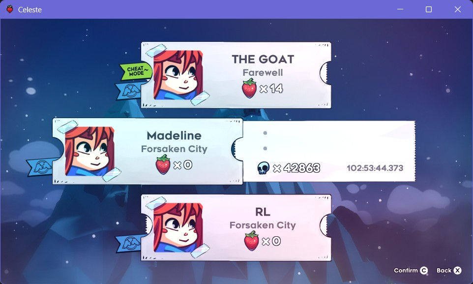
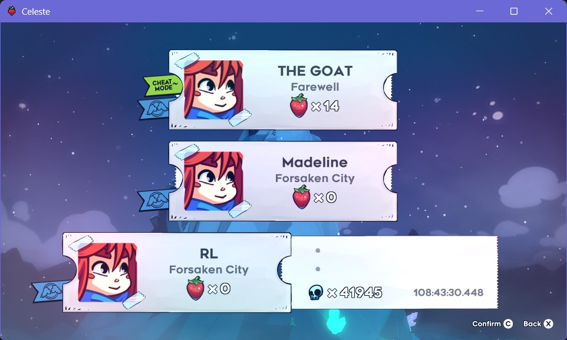

The agent's two training files

I've played Celeste for less than half the time and have nearly completed the game, collecting 198/202 berries. Seeing how many deaths and hours were spent just to clear one room makes me wonder how many would be needed to catch up to my stats.

 

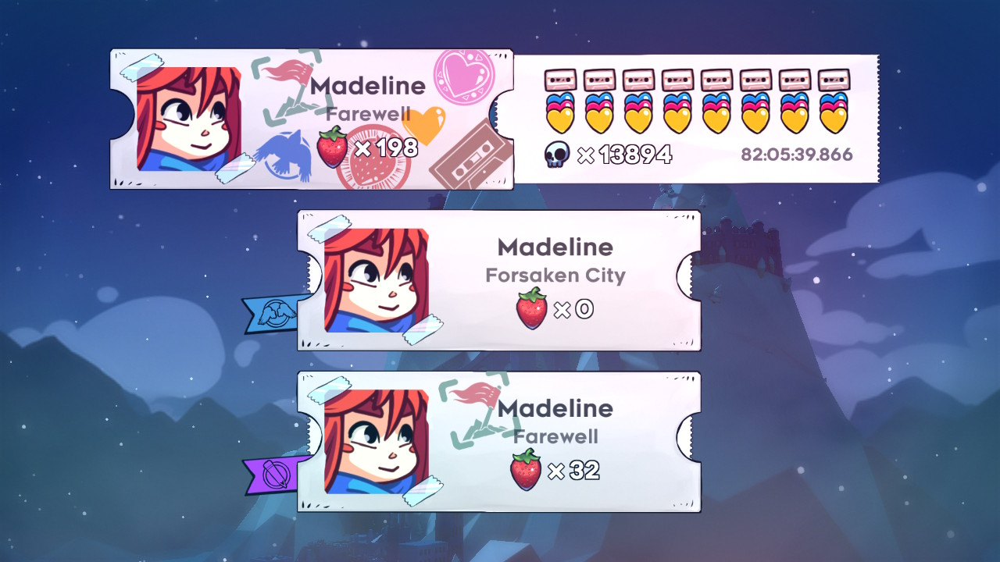

My game stats

### Why not the full game? Or at least all of 1A?
Some levels, like 1A, contain sections off screen that the game has to scroll to. I couldn't think of how to work with such rooms, since hardcoding goal zones wouldn't work. If I had access to the game data then maybe? But I felt it would be more realistic to focus on 1 room as an introductory project.

### What would you do differently next time?
State definitions!! If I ever do a machine learning project again, the first thing I'll pour hours into will be state definitions. It is the single most important aspect of any ML project (in my opinion), and literally everything depends on intelligent state definitions.

So that'll be the focus going forward. Otherwise, there are a few other things I'll need to keep in mind: exporting policies right away, understanding what actions are actually needed, better reward shaping, finding ways to speed up attempts, using version control, and so on.

A lot of the issues here were simple mistakes. Some I could have easily avoided, others I only recognized while writing this. So it'll be important to avoid them in the future. This write-up covered most, if not all, of the big problems.

One other change I'll need to consider is using classes for tracked objects. I think that'd be something worth looking into.

### What if we helped policy 3?
Due to how disappointing it was to see policy 3 fail, I decided to do one last evaluation. This time I held the up key whenever the agent reached the second wall, intervening against the poor policy. Any type of comparison between policies is worthless if one receives assistance, so this is just for my own curiosity.

 

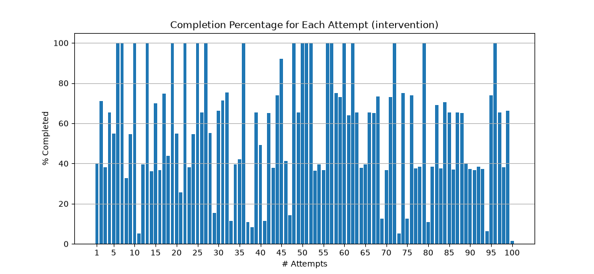
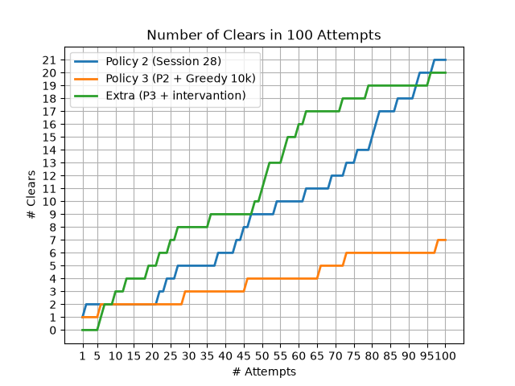
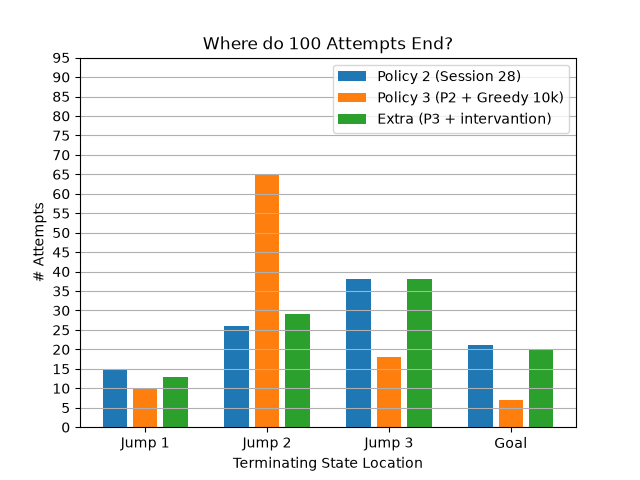

Comparing policies 2 and 3 against an assisted P3

The main thing we see is that with assistance, policy 3 is performing similarly to policy 2. The assisted version had 20 clears, 2 double clears, and 1 triple clear. This is almost identical to what policy 2 finished with. 

This "version" of policy 3 is purely hypothetical, so there's no guarantee such a policy ever actually forms. However, seeing the similarities, it really does show how poorly policy 3 was trained. Even with assistance, it has remained at a similar level to policy 2.

### What's next?
I'm currently thinking I'll do another project in a game. Computer vision probably will return, since I won't have a way to hook up the system to the game's internal data.

The two projects I'm thinking of are:

1. A project that focuses primarily on computer vision. The leading idea is to do this in the game STEEP. I still struggle to understand histogram backprojection, so this project would be an exercise focused on different vision techniques. STEEP is a 3D snow sports game where lighting actually affects character models, so I can't just hack a solution again. A lot of the environment is white, so the difficulty isn't a massive jump up from here.

2. A project focused primarily on intelligent state definitions. This project would be done in the game Guilty Gear Strive. The goal would be to teach an agent when to use reversal supers while under pressure. States will need to be defined such that the agent knows when it blocked an attack, how close the opponent is, how much meter it has, if it got hit, and so on. The computer vision side would be tracking multiple objects this time, but the main difficulty would be state definitions.

I'm currently leaning towards the second option. I think it would be 100% worth it to practice intelligently defining states. So many different things need to be tracked in fighting games, so I think it'd be the perfect place to get more experience defining states.

### Attempt videos
If you actually want to watch the evaluation attempts, you'll find them here:

https://youtube.com/playlist?list=PLV1oWvOq6ASU&si=_u2thaEarFJsGhhf

In the playlist there are 4 videos:

    policy 1 evaluation

    policy 2 evaluation

    policy 3 evaluation
    
    policy 3 with intervention

The videos themselves each show the 100 attempts analyzed in this write-up. 

You'll see two windows: One is the raw game footage, and the other is the computer vision tracking footage. So you can actually see the tracking system in action for each of the policies.